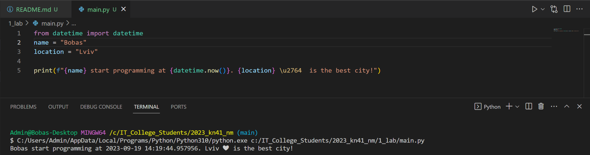

# Звіт до роботи №1
## Тема: _Оформлення робіт та перша програма_;
### Мета роботи: _Навчитись оформляти роботи з використання форматування Markdown та створити першу програму на Python_;
---
### Виконання роботи
- Результати виконання завдання:
    1. Створили [файл програми на Python](main.py);
    1. Програма вивела текст представлений на скріншоті: 
    1. Стронено Jupyter Notebook, попрацював з різними комірками, написав пояснення до коду програми;
    1. Результат виконання [Jupyter Notebook знаходиться у файлі `nb.ipynb`](nb.ipynb);
    1. Зробили запи до ChatGPT, він написав першу програму яка була також вставлена у [Jupyter Notebook](nb.ipynb);
    1. Навчились створювати та запускати програми на Python, попрацювали у Jupyter Notebook;

- програма яку згенерував ChatGPT:
```python
print("Привіт, світе!")
```

### Висновок: 
> у висновку потрібно відповісти на запитання:
- :question: Що зроблено в роботі: Створена та виконана перша програма на Python, попрацював у Notebook;
- :question: Чи досягнуто мети роботи: :white_check_mark:
- :question: Які нові знання отримано: навчився правювати з колміркаим в Jupyter Notebook;
- :question: Чи вдалось відповісти на всі питання задані в ході роботи: :white_check_mark:
- :question: Чи вдалося виконати всі завдання: :x:
- :question: Чи виникли складності у виконанні завдання: :ok_hand:
- :question: Чи подобається такий формат здачі роботи (Feedback);
- :question: Побажання для покращення (Suggestions);
---